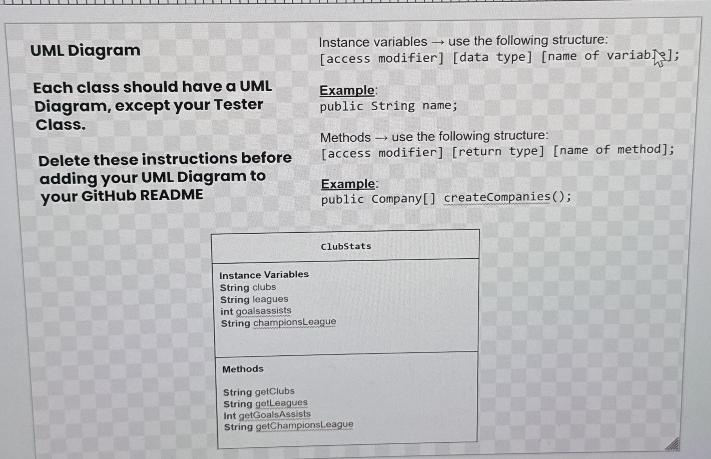

# Unit 3 - Data for Social Good Project 

## Introduction 

Software engineers develop programs to work with data and provide information to a user. Each user has different needs based on the information they are looking for from data. Your goal is to create a data analysis program for your user that stores and analyzes data to provide the information they need. 

## Requirements 

Use your knowledge of object-oriented programming, one-dimensional (1D) arrays, and algorithms to create your data analysis program: 
- **Write a class** – Write a class to represent your user or business and store and analyze their data with no-argument and parameterized constructors. 
- **Create at least two 1D arrays** – Create at least two 1D arrays to store the data that your user needs information about. 
- **Write a method** – Write a method that finds or manipulates the elements in a 1D array to provide the information your user needs. 
- **Implement a toString() method** – Write a toString() method that returns general information about the data (for example, number of values in the dataset). 
- **Document your code** – Use comments to explain the purpose of the methods and code segments and note any preconditions and postconditions. 

## User Story 

Include your User Story you analyzed for your project here. Your User Story should have the following format: 

 As a sports analyst,
 We would like to analyze and study the top 5 Soccer Leagues to see which league has the best statistics using the goals/assists, and champions league.

## Dataset 

Include a hyperlink to the source of your dataset used for this project. Additionally, provide a short description of each column used from the dataset, and the data type. 

Source/Dataset 

Dataset: https://fbref.com/en/ 
- **League Name** (String) - Name of the League
- **Club Name** (String) - Name of the Club
- **Champions League** (String) - There run in the Champions League
- **Goals and Assists** (String) - There overall goals and assists

## UML Diagram 

Put and image of your UML Diagram here. Upload the image of your UML Diagram to your repository, then use the Markdown syntax to insert your image here. Make sure your image file name is one work, otherwise it might not properly get display on this README. 

 

## Description 

Write a description of your project here. In your description, include as many vocab words from our class to explain your User Story, the chosen dataset and how your project addressed that users goals. If your project used the Scanner class for user input, explain how the user will interact with your project.

For our Data Social Good Project, we decided to create a place where Sports Analysts can analyze soccer statistics. More specifically, we used the top 5 leagues in the world and included the names, the club names, the goals and assists, and the champions league stats. We stored this as a text file (txt) where we used file readers to help us gather the information. Along with this, our main goal was for the output to be very clean. In this case, it would show the club name along with all there stats. We decide to use user input, where we asked the user what league they wanted to analyze, for example, if they inputed Bundesliga, the stats for each team in that league would show using enhanced for loops and to strings. Overall, this project will help soccer sports analysts. 